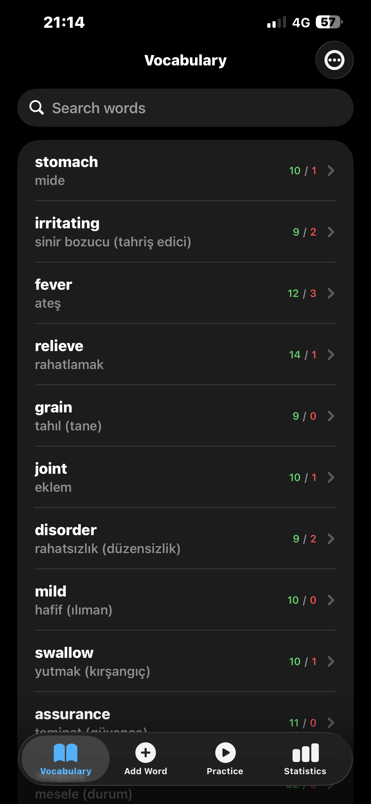
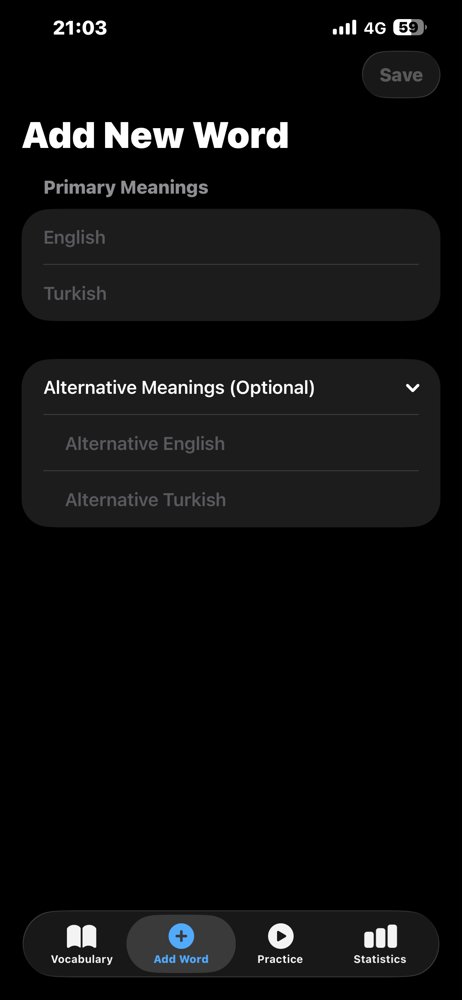
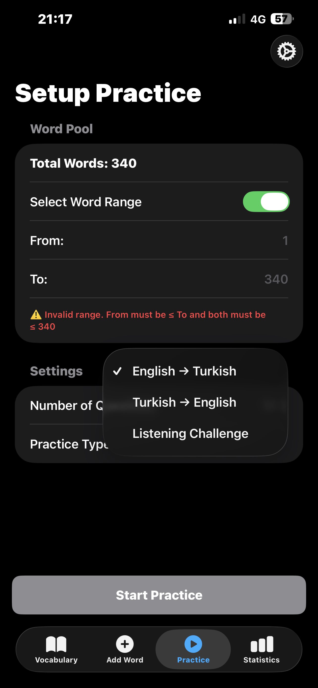
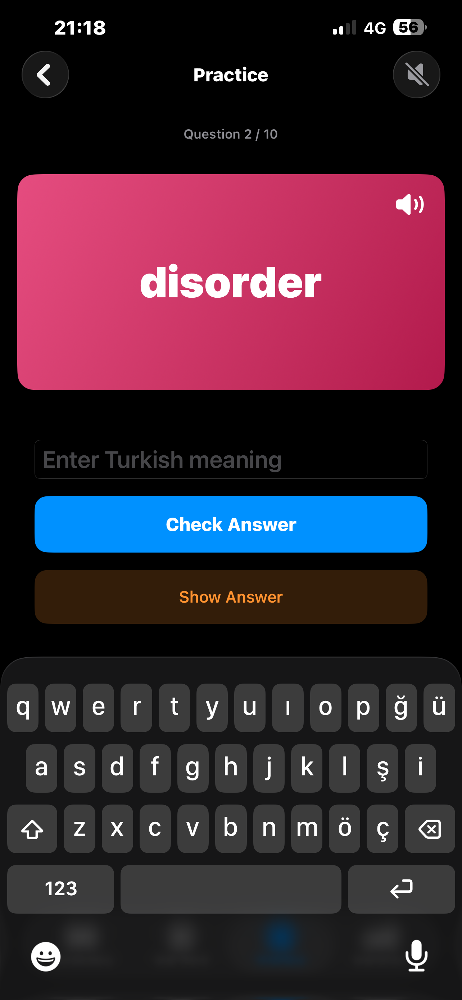
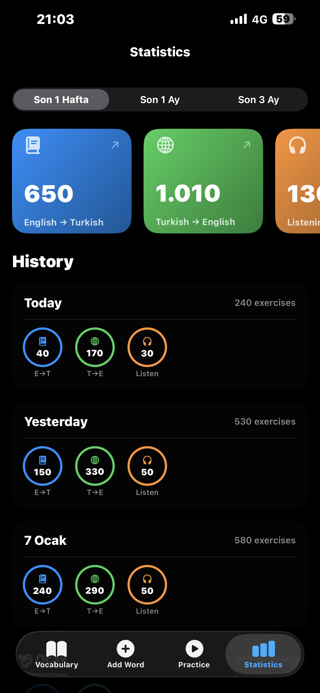
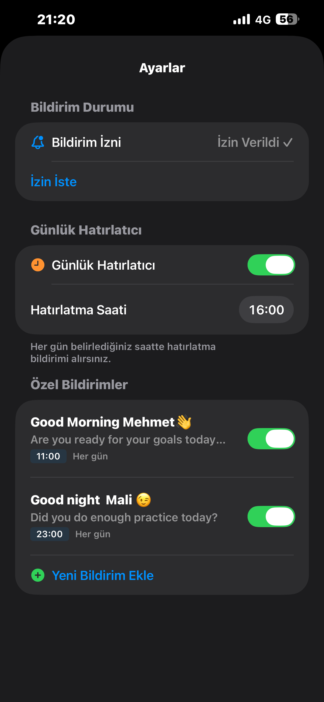
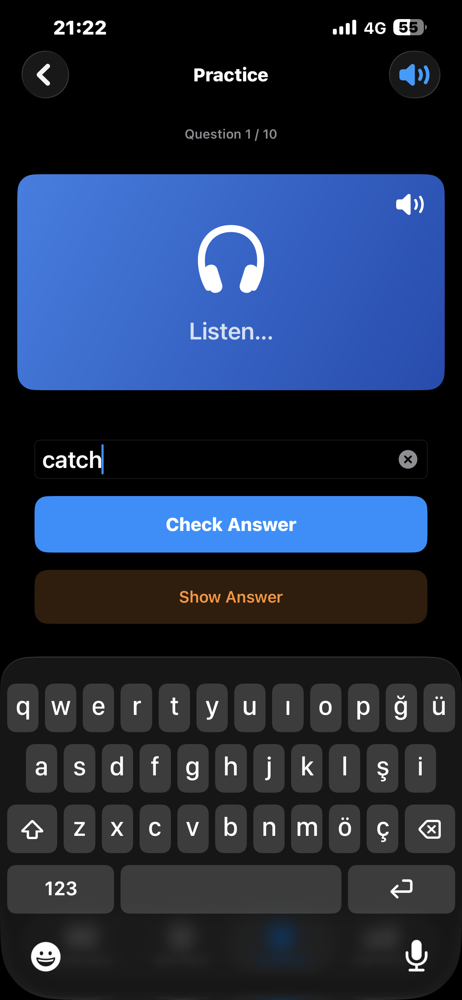
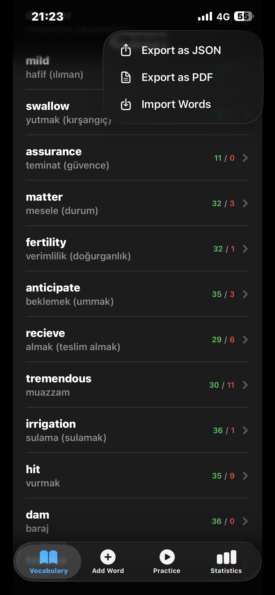

<div align="center">

# 📚 VocabularyPool

**A beautifully crafted iOS vocabulary learning app for mastering English-Turkish word pairs**

[](https://swift.org)
[](https://developer.apple.com/xcode/swiftui/)
[](https://developer.apple.com/xcode/swiftdata/)
[](https://www.apple.com/ios/)
[](LICENSE)

<p align="center">
  
</p>

[Features](#-features) • [Tech Stack](#-tech-stack) • [Architecture](#-architecture) • [Installation](#-installation) • [Usage](#-usage) • [Screenshots](#-screenshots)

</div>

---

## 🌟 Overview

**VocabularyPool** is a comprehensive vocabulary learning application designed to help users master English-Turkish word pairs through interactive quizzes, listening exercises, and smart progress tracking. Built entirely with SwiftUI and SwiftData, it showcases modern iOS development practices and delivers a polished, native user experience.

Whether you're a language learner building your vocabulary or a developer looking for SwiftUI/SwiftData implementation examples, VocabularyPool offers both educational value and technical insights.

---

## ✨ Features

### 📖 Vocabulary Management
- **Add words** with primary and alternative meanings for both languages
- **Search & filter** through your entire vocabulary instantly
- **Edit or delete** words with intuitive swipe gestures
- **Import/Export** vocabulary as JSON for backup and sharing
- **PDF Export** for printable word lists

### 🎯 Multi-Mode Practice System
| Mode | Description |
|------|-------------|
| **English → Turkish** | See the English word, type the Turkish meaning |
| **Turkish → English** | See the Turkish word, type the English translation |
| **🎧 Listening Challenge** | Hear the word spoken aloud, write what you hear |

### 🗣️ Text-to-Speech Integration
- Native **AVSpeechSynthesizer** for authentic pronunciation
- Automatic word pronunciation when questions appear
- Manual replay with speaker button
- Toggle sound on/off during practice

### 📊 Comprehensive Statistics
- Track practice sessions by type (E→T, T→E, Listening)
- View progress over **1 week, 1 month, or 3 months**
- Daily breakdown with beautiful stat cards
- Per-word correct/incorrect counters

### 🔔 Smart Notification System
- **Daily reminders** at your preferred time
- **Custom notifications** with flexible scheduling
- **Goal-based alerts**: 10 words per 2-day cycle
- Weekday selection for recurring notifications

### 🎨 Modern UI/UX
- Clean, intuitive tab-based navigation
- Colorful gradient question cards
- Dark-themed statistics dashboard
- Smooth animations and haptic feedback

---

## 🛠 Tech Stack

<table>
<tr>
<td align="center" width="150">

<br><strong>SwiftUI</strong>
<br><sub>Declarative UI</sub>
</td>
<td align="center" width="150">

<br><strong>Swift 5.9</strong>
<br><sub>Modern Swift</sub>
</td>
<td align="center" width="150">

<br><strong>SwiftData</strong>
<br><sub>Persistence</sub>
</td>
<td align="center" width="150">

<br><strong>Xcode 15+</strong>
<br><sub>Development</sub>
</td>
</tr>
</table>

### Core Technologies

| Technology | Purpose | Implementation |
|------------|---------|----------------|
| **SwiftUI** | UI Framework | Declarative views, navigation, animations |
| **SwiftData** | Data Persistence | `@Model`, `@Query`, `ModelContainer` |
| **AVFoundation** | Text-to-Speech | `AVSpeechSynthesizer`, `AVAudioSession` |
| **UserNotifications** | Local Notifications | Scheduled reminders, custom alerts |
| **Combine** | Reactive Programming | `@Published`, `ObservableObject` |
| **UniformTypeIdentifiers** | File Handling | JSON/PDF export, document picker |

---

## 🏗 Architecture

VocabularyPool follows a clean **MVVM-inspired** architecture with SwiftData for persistence:

```
VocabularyPool/
├── 📱 App
│   └── VocabularyPoolApp.swift      # App entry point, ModelContainer setup
│
├── 🎨 Views
│   ├── ContentView.swift            # Main TabView navigation
│   ├── AddWordView.swift            # Word creation form
│   ├── EditWordView.swift           # Word editing interface
│   ├── PracticeConfigView.swift     # Quiz configuration
│   ├── QuizView.swift               # Interactive quiz engine
│   ├── StatisticsView.swift         # Progress dashboard
│   └── SettingsView.swift           # Notification settings
│
├── 📦 Models (SwiftData)
│   ├── Word.swift                   # Core vocabulary model
│   ├── PracticeSession.swift        # Daily practice tracking
│   ├── CustomNotification.swift     # User-defined notifications
│   └── WordAdditionTracker.swift    # Goal tracking system
│
├── 🔧 Services
│   └── NotificationManager.swift    # Centralized notification handling
│
└── 🎯 Assets
    └── Assets.xcassets              # App icons, colors
```

### Data Models

```swift
// Core Word Model
@Model
final class Word {
    var english: String
    var turkish: String
    var englishAlt: String?      // Alternative meaning
    var turkishAlt: String?      // Alternative meaning
    var correctCount: Int        // Quiz statistics
    var wrongCount: Int
    var lastStudied: Date?
    var timestamp: Date          // Creation date
}

// Practice Session Tracking
@Model
final class PracticeSession {
    var date: Date
    var englishToTurkishCount: Int
    var turkishToEnglishCount: Int
    var listeningCount: Int
}
```

### Key Design Patterns

- **Singleton Pattern**: `NotificationManager.shared` for centralized notification handling
- **Dependency Injection**: `@Environment(\.modelContext)` for data operations
- **Observer Pattern**: `@Query` for reactive data fetching
- **Protocol-Oriented**: Codable conformance for import/export

---

## 📲 Installation

### Prerequisites
- macOS Sonoma 14.0+
- Xcode 15.0+
- iOS 17.0+ deployment target

### Steps

1. **Clone the repository**
   ```bash
   git clone https://github.com/malisevdinoglu/VocabularyPool.git
   cd VocabularyPool
   ```

2. **Open in Xcode**
   ```bash
   open VocabularyPool.xcodeproj
   ```

3. **Select your target device**
   - Choose an iOS 17+ simulator or connected device

4. **Build and Run**
   - Press `⌘ + R` or click the Play button

> **Note**: No external dependencies required! The project uses only native Apple frameworks.

---

## 📖 Usage

### Adding Your First Word

1. Navigate to the **"Add Word"** tab
2. Enter the English word and Turkish meaning
3. Optionally expand "Alternative Meanings" for synonyms
4. Tap **"Save"** to add to your vocabulary

### Starting a Practice Session

1. Go to the **"Practice"** tab
2. Configure your session:
   - Select number of questions (5-30)
   - Choose practice type (E→T, T→E, or Listening)
   - Optionally set a word range
3. Tap **"Start Practice"**
4. Type your answers and get instant feedback

### Tracking Your Progress

1. Visit the **"Statistics"** tab
2. Use the period selector (Week/Month/3 Months)
3. View totals in the summary cards
4. Scroll through daily breakdowns

### Setting Up Reminders

1. Access Settings via the ⚙️ icon in Practice tab
2. Enable **"Daily Reminder"** and set your preferred time
3. Create custom notifications for specific days/times

---

## 📸 Screenshots

<div align="center">
<table>
<tr>
<td align="center"><br><sub>Vocabulary List</sub></td>
<td align="center"><br><sub>Add Word</sub></td>
<td align="center"><br><sub>Practice Setup</sub></td>
<td align="center"><br><sub>Quiz Mode</sub></td>
</tr>
<tr>
<td align="center"><br><sub>Statistics</sub></td>
<td align="center"><br><sub>Settings</sub></td>
<td align="center"><br><sub>Listening Mode</sub></td>
<td align="center"><br><sub>Export Options</sub></td>
</tr>
</table>
</div>

---

## 🔑 Key Implementation Highlights

### SwiftData Integration

```swift
// Model Container Setup
var sharedModelContainer: ModelContainer = {
    let schema = Schema([
        Word.self,
        PracticeSession.self,
        CustomNotification.self,
        WordAdditionTracker.self,
    ])
    let modelConfiguration = ModelConfiguration(schema: schema, isStoredInMemoryOnly: false)
    return try! ModelContainer(for: schema, configurations: [modelConfiguration])
}()

// Reactive Queries
@Query(sort: \Word.timestamp, order: .reverse) private var words: [Word]
```

### Text-to-Speech Implementation

```swift
private func speakCurrentWord() {
    let utterance = AVSpeechUtterance(string: currentWord.english)
    utterance.voice = AVSpeechSynthesisVoice(language: "en-US")
    utterance.rate = 0.5
    speechSynthesizer.speak(utterance)
}
```

### Smart Answer Validation

```swift
// Normalize and compare answers (handles Turkish characters, alternatives)
let input = userAnswer.trimmingCharacters(in: .whitespacesAndNewlines)
    .lowercased()
    .folding(options: .diacriticInsensitive, locale: .current)

let isCorrect = correctAnswers.contains { $0 == input }
```

---

## 🚀 Future Roadmap

- [ ] **iCloud Sync** - Sync vocabulary across devices
- [ ] **Spaced Repetition** - Smart review scheduling (SM-2 algorithm)
- [ ] **Widget Support** - Home screen word of the day
- [ ] **Apple Watch** - Quick review on your wrist
- [ ] **Siri Shortcuts** - Voice-activated practice
- [ ] **Themes** - Customizable color schemes
- [ ] **Multiple Languages** - Beyond English-Turkish

---

## 🤝 Contributing

Contributions are welcome! Here's how you can help:

1. **Fork** the repository
2. **Create** a feature branch (`git checkout -b feature/AmazingFeature`)
3. **Commit** your changes (`git commit -m 'Add AmazingFeature'`)
4. **Push** to the branch (`git push origin feature/AmazingFeature`)
5. **Open** a Pull Request

Please ensure your code follows the existing style and includes appropriate documentation.

---

## 📄 License

This project is licensed under the MIT License - see the [LICENSE](LICENSE) file for details.

---

## 👨‍💻 Author

**Mehmet Ali Sevdinoğlu**

- GitHub: [@malisevdinoglu](https://github.com/malisevdinoglu)
- LinkedIn: [Mehmet Ali Sevdinoğlu](https://www.linkedin.com/in/mehmet-ali-sevdinoglu)

---

<div align="center">

**If you found this project helpful, please consider giving it a ⭐️**

<br>

Made with ❤️ and SwiftUI

</div>

