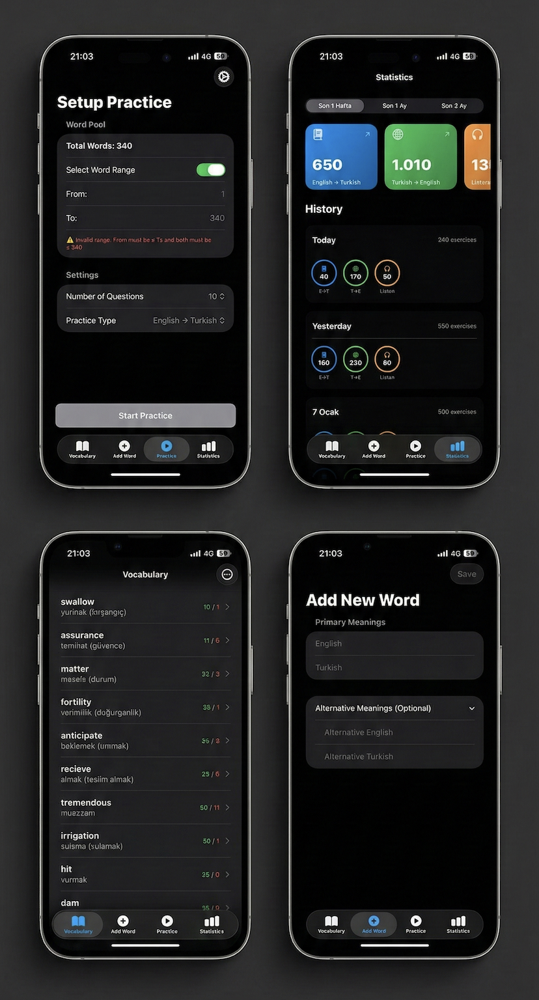
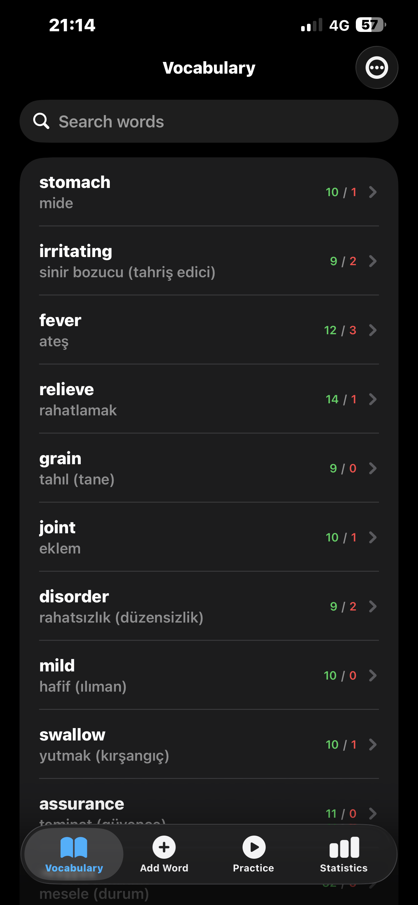
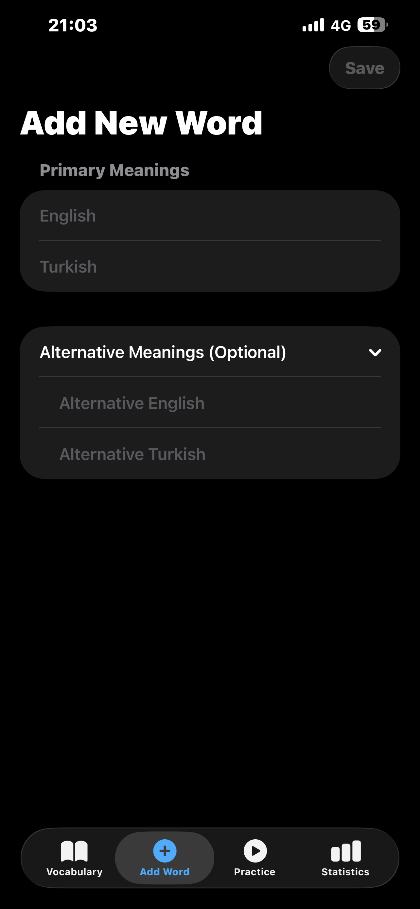
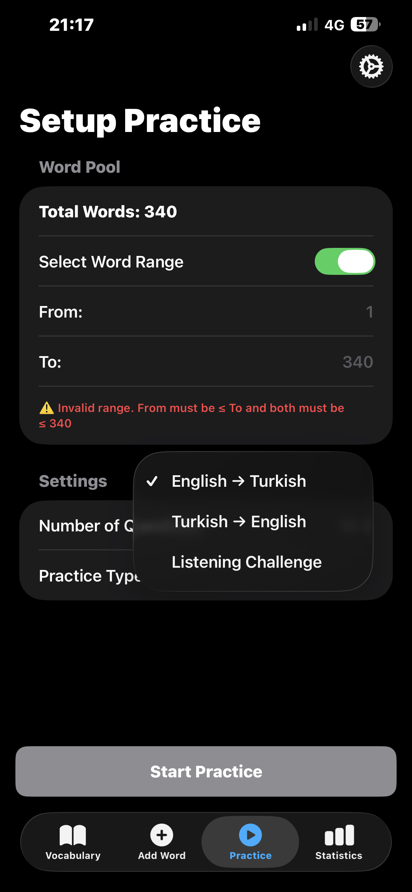
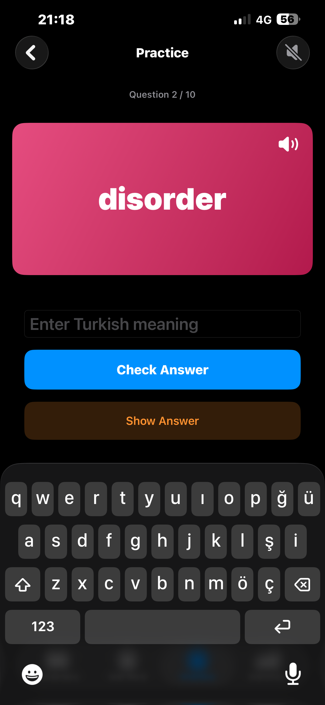
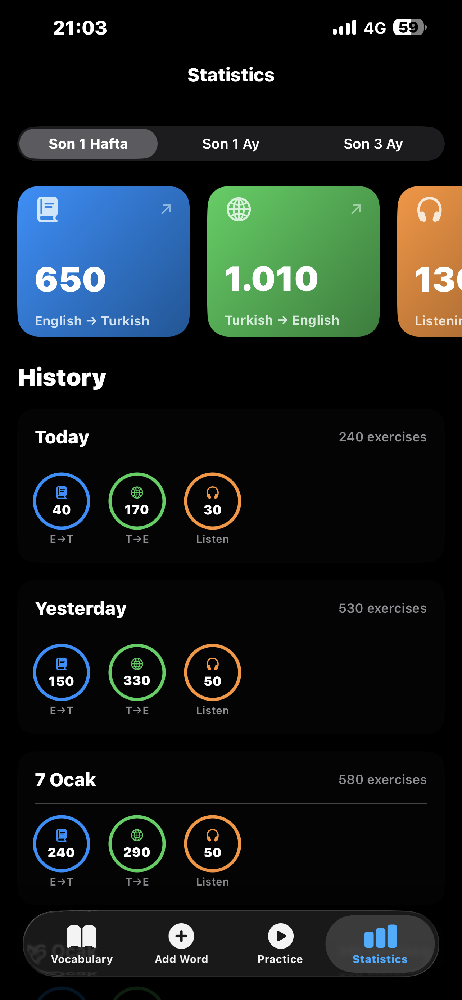
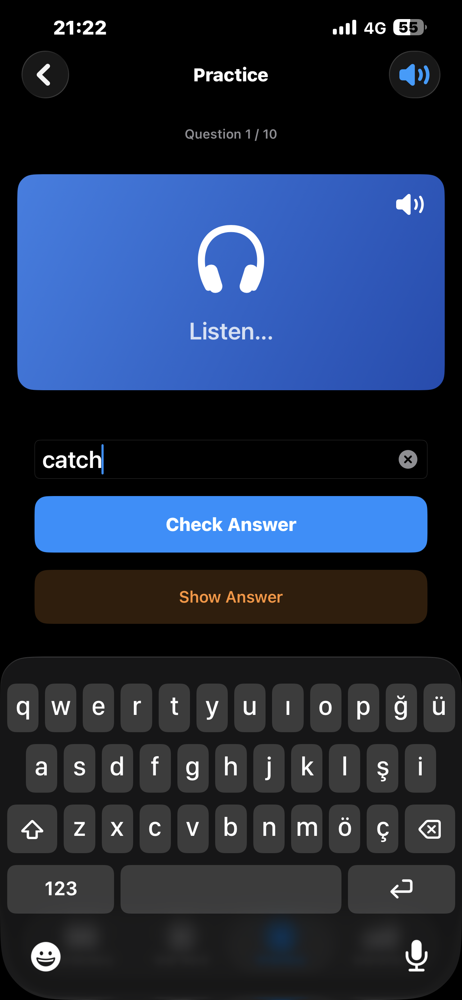
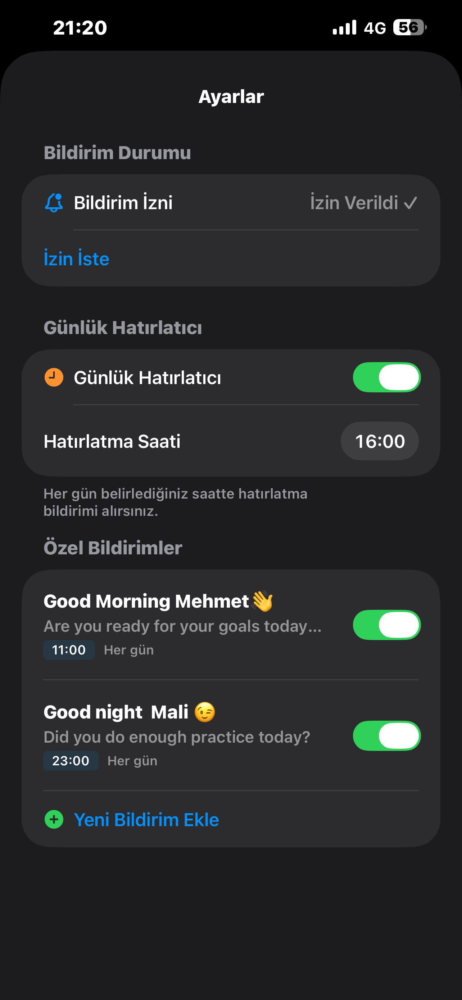
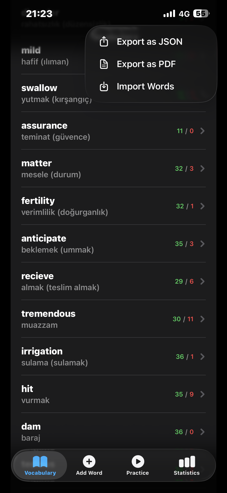

# VocabularyPool

VocabularyPool, dil öğrenenlerin kelime ezberleme sürecindeki unutma problemini çözmek amacıyla geliştirilmiş yerel bir iOS uygulamasıdır. Kullanıcıların kendi İngilizce-Türkçe kelime havuzlarını oluşturmasını; çoklu test modları, yerel sesli telaffuz desteği ve veri odaklı istatistiklerle öğrenmeyi kalıcı hale getirmesini sağlar.

<p align="center">
  
</p>

## ✨ Özellikler (Features)
- **Kelime Havuzu Yönetimi:** Birincil ve alternatif anlam desteği, anlık filtreleme, sezgisel kaydırma (swipe) hareketleriyle düzenleme/silme ve JSON/PDF formatında içe/dışa aktarma.
- **Etkileşimli Alıştırma Modları:** İngilizce → Türkçe, Türkçe → İngilizce testler ve yazarak pekiştirmeyi sağlayan telaffuz destekli dinleme (Listening Challenge) sınavları.
- **Özelleştirilebilir Pratik Oturumları:** Soru sayısı (5-30) ve belirli kelime aralığı seçimiyle ihtiyaca göre kolayca yapılandırılabilen dinamik quiz akışı.
- **Akıllı Cevap Doğrulama:** Türkçe karakter duyarlılığı, küçük/büyük harf toleransı ve alternatif karşılıkları kapsayan akıllı eşleştirme algoritması.
- **Telaffuz ve Ses Desteği (TTS):** Apple AVFoundation (AVSpeechSynthesizer) entegrasyonuyla otomatik veya manuel sesli telaffuz dinleme ve anlık ses denetimi.
- **Performans & İstatistik Takibi:** 1 haftalık, 1 aylık ve 3 aylık periyotlarda başarı grafiği, günlük çalışma yoğunluğu ve kelime bazlı doğru/yanlış sayaçları.
- **Akıllı Hatırlatıcılar & Hedefler:** Tercih edilen gün ve saatlerde yerel bildirimler ile döngüsel çalışma alışkanlığı kazandıran hedef takip sistemi (örn. 2 günde 10 kelime).

## 🛠️ Teknolojiler & Mimari (Tech Stack)
- **Mobile / UI:** Swift 5.9+, SwiftUI (iOS 17.0+), modern ve bildirimsel bileşen mimarisi
- **Mimari:** MVVM tasarım deseni, reaktif state yönetimi (Combine, Observation)
- **Veri Kalıcılığı (DB):** SwiftData (`@Model`, `@Query`, `ModelContainer`, `AppMigrationPlan`)
- **Sistem Framework'leri:** AVFoundation (Ses Sentezi), UserNotifications (Yerel Bildirimler), UniformTypeIdentifiers (Belge Yönetimi)
- **Bağımlılıklar:** Sıfır üçüncü parti kütüphane (Yalnızca yerel Apple SDK bileşenleri)

## 🚀 Kurulum (Getting Started)
```bash
# Depoyu yerel ortama klonlayın
git clone https://github.com/malisevdinoglu/VocabularyPool.git

# Proje klasörüne geçiş yapın
cd VocabularyPool

# Projeyi Xcode ile başlatın
open VocabularyPool.xcodeproj
```
> **Gereksinimler:** macOS Sonoma 14.0+, Xcode 15.0+, iOS 17.0+ (Simülatör veya fiziksel cihaz). Açılan projeyi `⌘ + R` kısayolu ile doğrudan derleyip çalıştırabilirsiniz.

## 📸 Ekran Görüntüleri (Screenshots)
<div align="center">
<table>
<tr>
<td align="center"><br><sub>Kelime Listesi</sub></td>
<td align="center"><br><sub>Kelime Ekleme</sub></td>
<td align="center"><br><sub>Alıştırma Ayarı</sub></td>
<td align="center"><br><sub>Quiz Modu</sub></td>
</tr>
<tr>
<td align="center"><br><sub>İstatistikler</sub></td>
<td align="center"><br><sub>Dinleme Modu</sub></td>
<td align="center"><br><sub>Ayarlar</sub></td>
<td align="center"><br><sub>Dışa Aktarma</sub></td>
</tr>
</table>
</div>
